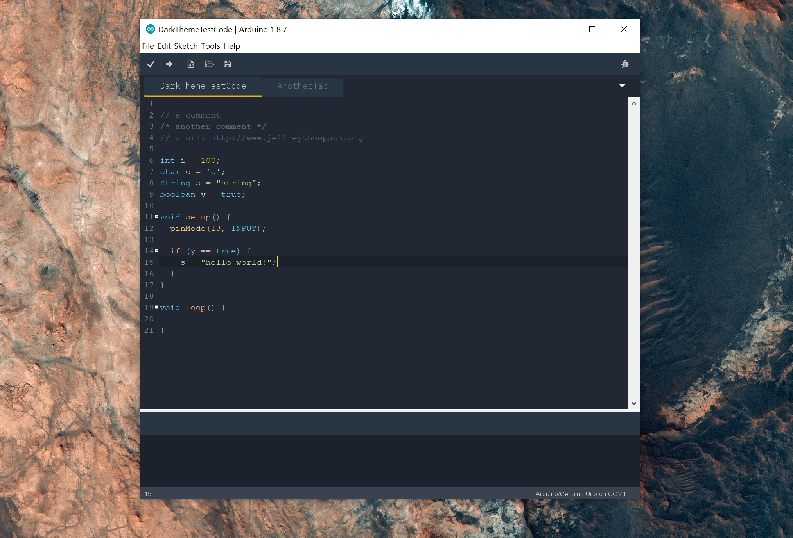

# Ayu-Mirage for the Arduino IDE

### Installation
Either replace the default theme or create a themes directory in your sketch folder and copy the `AyuMirage` into it. This second option shows up in the preference screen on restart.
